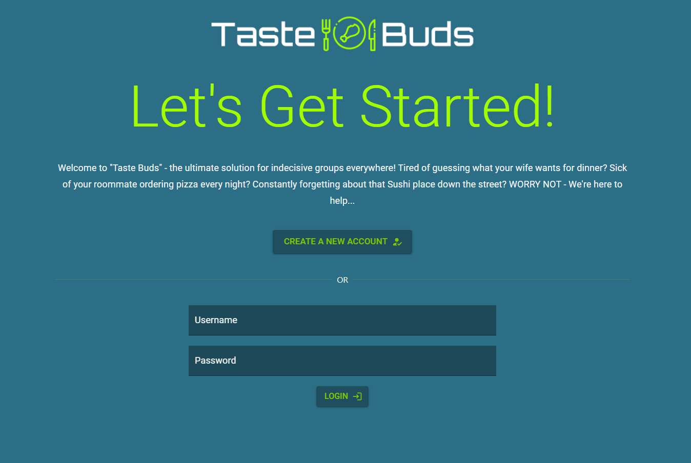
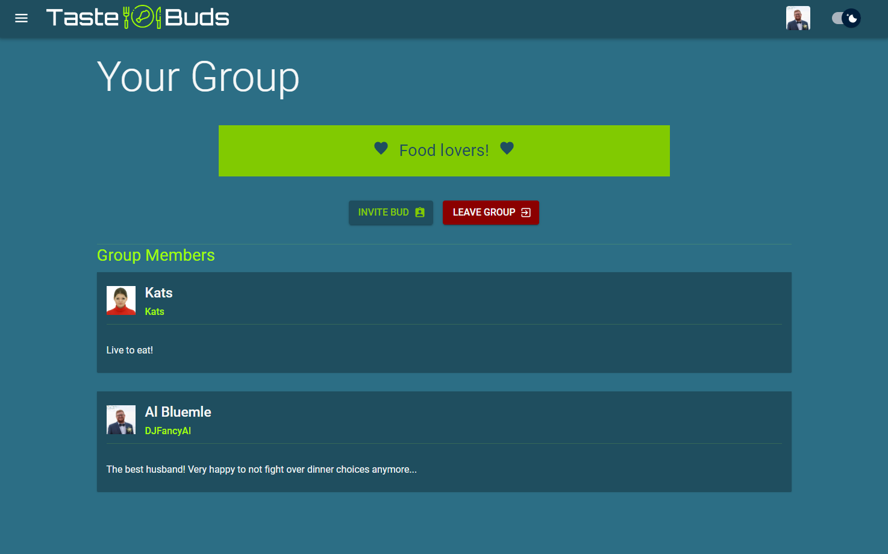
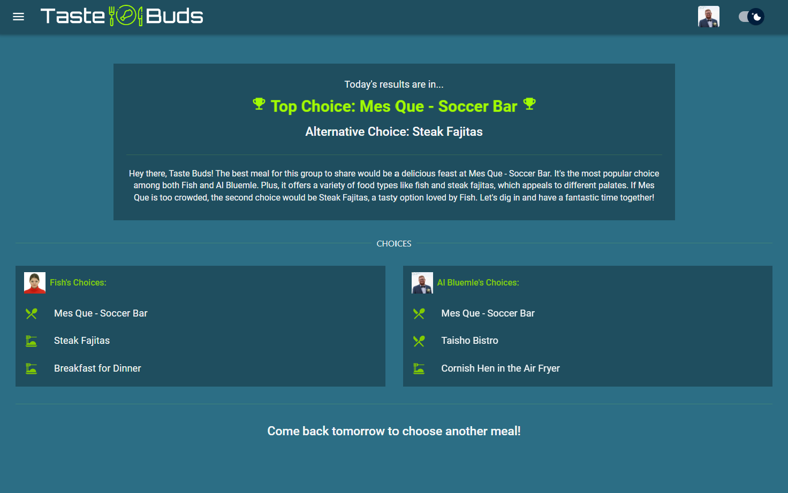

# Taste-Buds

## Description

The "Taste Buds" app was create an an example of a full-stack application AND to solve a pesky problem. The app allows users to create an account, join others in a group, choose their daily meal options alongside fellow group members, and get useful results from Taste Bud's insightful AI Buddy.

### Get Started

Upon using the app for the first time - all users will be directed to the "Get Started" page. From here the user has two options - to register a new account or to log in with the form on the page.

Previously registered users can login by entering their username and password into the fields - then clicking the "Login" button. Upon login the user will be directed to the "Today" page.

### Register User

A first time user can create an account by filling out the "Username", "Password", and "Confirm Password" fields. Upon clicking the "Create Account" button - the user will be directed to their profile page, where they can change their display name.

### Profile Page

The profile page allows the user to view their details and make changes to their account. Once changes have been made - click the "Update User" button to save them.

### Group Page

The group page will look different depending on whether the user has already joined a group or not. When using this page for the first time - the user has the option to join an existing group or to create a new one. If they create their own group, then they have to option to invite other members to join the group.

If they would like to join an existing group, then they must search for a member of that group. They can search either by using the name or username, then click to join the group. This will send a request.

If the user is already in a group, then they can view important group information on this page - including the members of the group, and if there are any pending requests.

### Today Page

This page is also dynamic and is where the action really happens. Upon arriving at this page - the user will see their meal options. They can add new options, filter by meal type, and drag options to the selection fields. Once the selections have been made - the page will change.

The user will now see a notification - indicating that the other users have not submitted results, or "Taste Buddy" will analyze the group's submissions and give the vital feedback.

The next day, you may return to this page and start again.

## Demo

A live demo of "Taste Buds" is available here: http://tastebuds-env.eba-h82mfrx2.us-east-1.elasticbeanstalk.com/

On this demo - a user may register to create an account, and perform all of the functions listed above. Please participate on the app by creating a group and choosing your meals!

## Technologies

This full stack application uses several front-end and back-end technologies. Specifically it uses the MERN Stack ([MongoDB](https://www.mongodb.com/), [Express.js](https://expressjs.com/), [React.js](https://react.dev/), and [Node.js](https://nodejs.org/en)). Additionally it uses the [OpenAi API](https://platform.openai.com/) to analyze results.

### React

The front end of this application uses [React](https://react.dev/) to create a fluid user experience. React-Router-Dom is used to create the appearance of a multi page site, while users are moving between components. React has provided a seamless yet dynamic user experience.

### MaterialUI

The front end is also styled using [MaterialUI](https://mui.com/). This creates a familiar, but very modern feel. The style is consistent and animations are sharp.

### Express

The back end server is built using [Express.js](https://expressjs.com/). Express allowed us to use JavaScript for building our routes and serving data to the front end. Within Express we also used Bcrypt to hash and verify passwords. Additionally we create JSON Web Tokens for authentication.

### MongoDB

App data is stored in a [Mongo](https://www.mongodb.com/) Atlas Database. This cloud solution stores all blog, author, and comment information.

## Technical Information

"Taste Buds" may be installed and used locally. To do this begin by downloading this repository. Once downloaded you will notice two files - client and server. The client directory contains the front end service and the server directory contains the back end service. You will need to run both of these services for the app to work.

To start the back end, open a console and change into the server directory. You'll first need to create a .env file and provide these environment variables:

- PORT - the port the back end will run on.
- MONGO_URI - the URI of your MongoDB connection. This may be a local address or remote.
- JWT_SECRET - this will be a random string of 32 characters
- OPENAI_API_KEY - will be used for Open AI requests, used for analysis.

Next you will need to install all of the dependencies by running "npm install". Lastly you can begin the app by running "npm start."

Now it's time to run the front end - open another console and change into the /client directory. Here you'll need to run "npm install" again to add dependencies. Then you may run "npm start" to begin the React service. You should now be able to access the app in your local web browser. If you'd like to create a production build of the React app then you must run "npm run build" to create the build files.

## Issues

The app has some known issues:

- The request notification mark does not disappear when a request is approved or rejected (until page reload)
- The "Waiting to Join" message will disappear when the page reloads - even if the user is still waiting.
- Dragging items from the selected list back to the available items list can cause duplicate items.

## API Documentation

This API allows you to interact with a "Taste Buds" platform, where you can create users, groups, items and more. The API uses JSON for request bodies.

### Base URL

The base URL for accessing the Taste Buds API is:

### Authentication

The API uses JSON Web Token (JWT) for authentication. To access protected endpoints, you need to include a valid JWT token in the request headers.

### Endpoints

#### Home Page

- URL: /
- HTTP Method: GET
- Description: Retrieves the Taste Buds "Welcome" message.

#### Users View

- URL: /users/
- HTTP Method: GET
- Description: Retrieves all users registered to Taste Buds.

#### Create User

- URL: /users/
- HTTP Method: POST
- Description: Creates a new user and returns a token.
- Required Fields (Request Body):
  - username: The name the user will log in with.
  - password: The user's password.
  - confirmPassword: The user's password for confirmation

#### Single User View

- URL: /users/user
- HTTP Method: GET
- Description: Retrieves the user's information.

#### Login User

- URL: /users/login
- HTTP Method: POST
- Description: Logs in the user by returning a token.
- Required Fields (Request Body):
  - username: The user's username.
  - password: The user's password.

#### Edit User

- URL: /users/:id
- HTTP Method: PUT
- Description: Updates the profile of the user identified by the id parameter.
- Request Body: You can include any combination of the following fields to update:
  - username: The updated username of the user.
  - name: The updated name of the user.
  - password: The updated password of the user.
  - bio: The updated biography of the user.
  - pic: The updated profile picture of the user.

#### Delete User

- URL: /users/:id
- HTTP Method: DELETE
- Description: Deletes the user account identified by the id parameter.

#### Groups View

- URL: /groups/
- HTTP Method: GET
- Description: Retrieves all groups active in Taste Buds.

#### Create Group

- URL: /groups/
- HTTP Method: POST
- Description: Creates a new group with the creating member.
- Required Fields (Request Body):
  - member: A user ID

#### Single Group View

- URL: /groups/:id
- HTTP Method: GET
- Description: Retrieves the group's information by the parameter ID.

#### Edit Group

- URL: /groups/:id
- HTTP Method: PUT
- Description: Updates the profile of the group identified by the id parameter.
- Request Body: You can include any combination of the following fields to update:
  - members: The updated list of group members.
  - description: The updated description of the group.
  - type: The updated type of group (Couple, Group).
  - items: The updated list of meal items.
  - requests: The updated list of user requests.

#### Create Request

- URL:/groups/request/:budId/:userId
- HTTP Method: GET
- Description: Creates a request by the user to join the other user's group.

#### Add Member

- URL:/groups/:groupId/:userId
- HTTP Method: GET
- Description: Adds the member to the group and removes their join request.

#### Delete Member

- URL: /groups/:groupId/:userId'
- HTTP Method: DELETE
- Description: Removes the user as a member of the group and will delete the group if there are no more members.

#### Add Item

- URL:/groups/:id/items
- HTTP Method: POST
- Description: Adds a meal choice to group's item list.
- Request Body: You can include any combination of the following fields to update:
  - name: The name of the meal option.
  - type: The meal type (Take Out, Eat In, Dine Out)

#### Delete Item

- URL: /groups/:id/items
- HTTP Method: DELETE
- Description: Removes an item from the group's item list.

#### Days View

- URL: /days/:id/
- HTTP Method: GET
- Description: Retrieves all days associated with the group.

#### Current Day View

- URL: /days/:id/today
- HTTP Method: GET
- Description: Retrieves the current day, or creates a new one if it doesn't exist.

#### Add Selections

- URL: /days/:id/
- HTTP Method: POST
- Description: Adds a member's selections to the current day.

#### Reset Choices

- URL: /days/:dayId/:userId
- HTTP Method: GET
- Description: Removes the member's choices for the current day.
